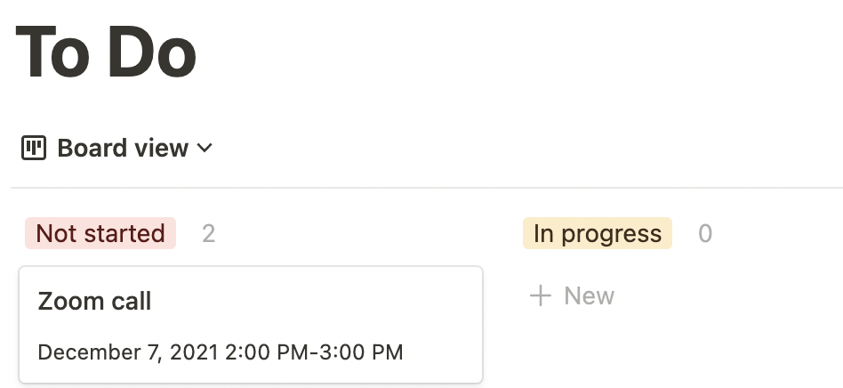
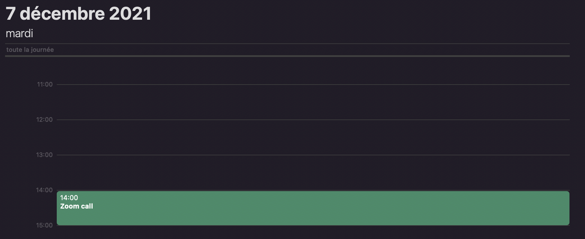
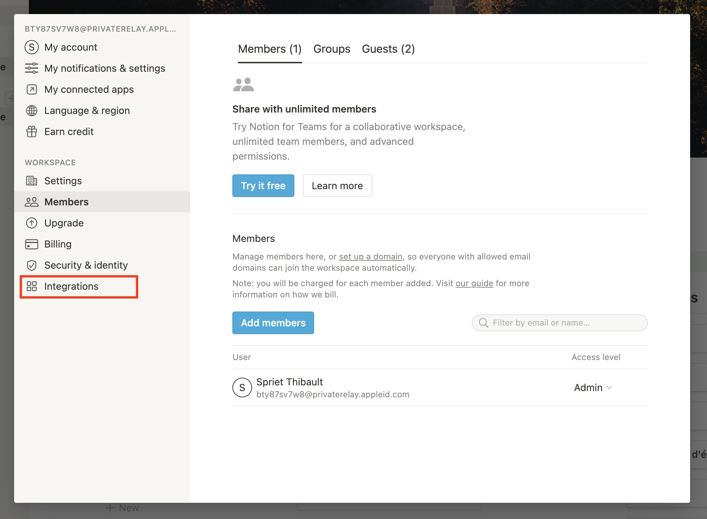
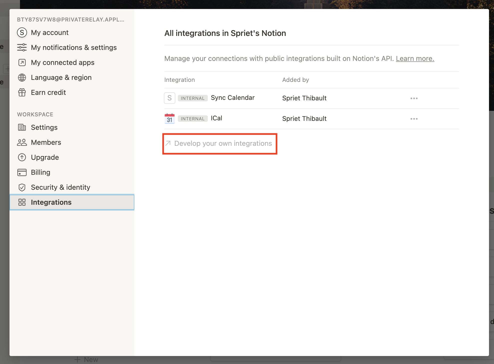
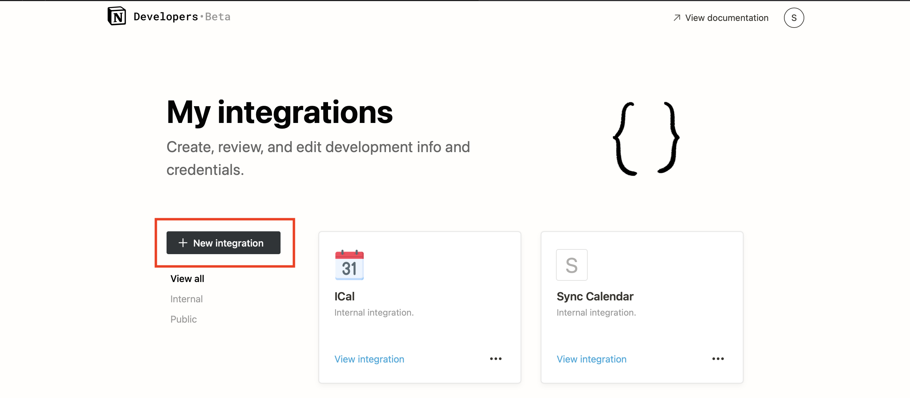

# Automated synchronization of Notion databases and Apple Calendar

Do you often use Notion board databases for **roadmaps** or for your day-to-day **todos** ? Do you want your tasks to be automatically added to your Apple Calendar when a date is defined ? Hopefully you are on the good *repo*.

In brief here is a typical use case :  

1. You add a **task** in your board database, with a date specified

1. This **task** will be added to your Apple Calendar app


Then if the Notion card got modified or deleted, the changes will automatically be taken into account in the Apple Calendar.

*Note :* The synchronizations are triggered based on the crontab job you will define.

## Installation

In this section, I go through all the necessary steps to set up the project on your local machine.

### Requirements
* macOS version 10.5 or later
* tested on python version 3.8.12

### Notion integration

You will have to create an internal integration in the Notion app. If you want to know how to get the Notion integration token, more info [here](https://developers.notion.com/docs/authorization). Here is a simple step by step tutorial to create an integration and get the corresponding token. This token will be needed for what follows.

1. From Notion go to **settings & members**. 

    
1. From the pop-up click on **integrations**
    
1. Then click on the link where you can read "**Develop your own integrations**"
    
    It should open up a new window inside your browser. From here you may need to connect to your account.
1. Click on **new integration**
    
    Give it a name and associate it with a workspace. Finally click submit.
1. You should be able to show you integration token. Keep it somewhere you will need it later.

The final step is to share your integration with the database you want to link with Apple calendar. To do so, come back to Notion and open your database as a page. In the top right corner, press **share**, click on the text box and you should be able to select your integration. Finally, click **invite**

### Install the project on your computer

1. Clone the repository in your desired location  
    A repository is like a folder on GitHub. This repository contains all the code needed to run the project.  
    To get the repository on your computer you need to clone it, this will download a copy of all files on your computer. To do so :  
    1. Open up your Terminal application
    1. Check if git is installed :
        ```shell
        git --version
        ``` 
        You should get output like :

        ```shell
        git version 2.32.0 (Apple Git-132)
        ```
        Otherwise check the [official documentation](https://git-scm.com/book/en/v2/Getting-Started-Installing-Git) to install the git client.
    1. Move to your desired location
        
        Inside your terminal app **cd** to the location where you want to clone the repository
        
        As matter of example :
        
        ```shell
        cd /Users/sprietthibault/scripts/
        ```
    
    1. Clone the repository

    ```shell
    git clone https://github.com/thibaultspriet/SyncNotionCalendar.git
    ```
1. Execute installation script :
    ```shell
    ./install.sh
    ```
Follow the steps prompted in the terminal. If a pop-up appear you can accept.

## Questions

In case you have a question, feel free to open an [issue](https://github.com/thibaultspriet/SyncNotionCalendar/issues/new/choose).

## Sponsorship  

If you find this project interesting and handy, you can support me on [Patreon](https://patreon.com/code_tibo). I would be really grateful !
